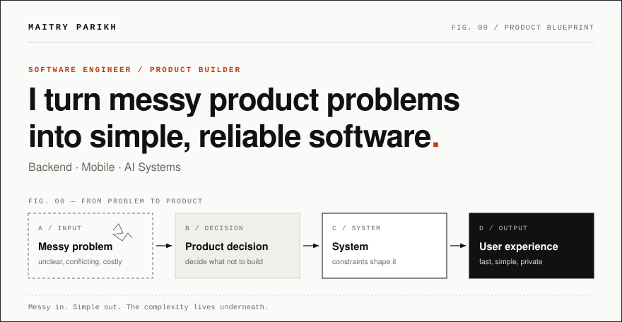
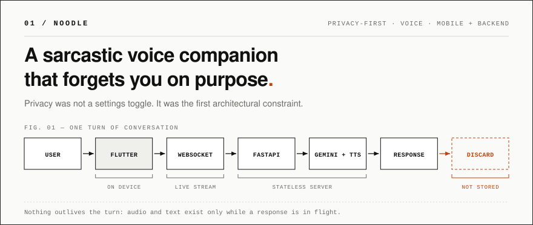
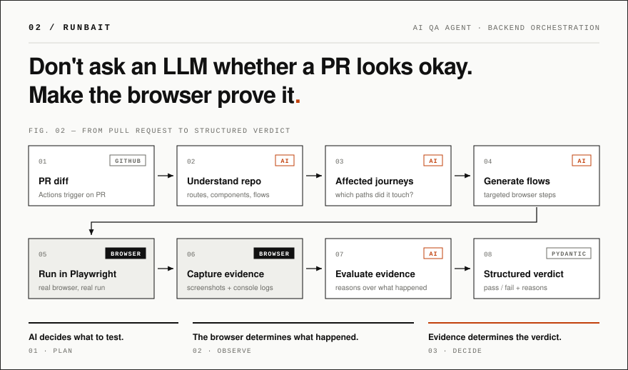
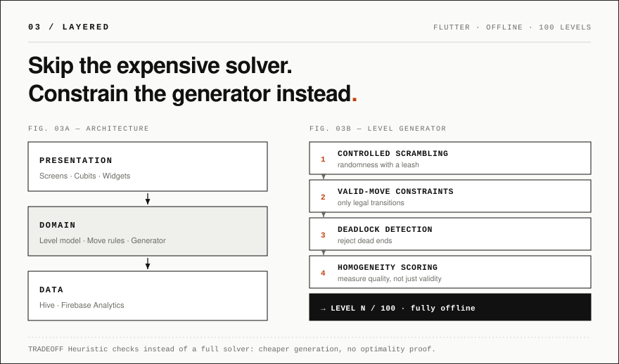
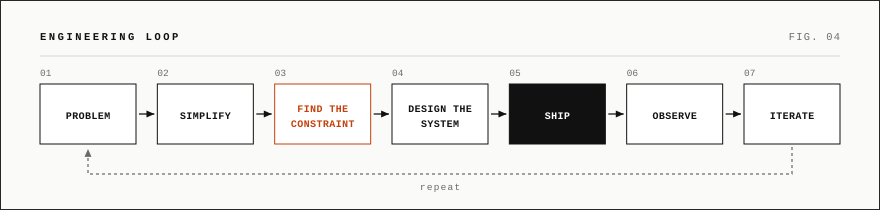

  <b><a href="#work">WORK</a></b> &nbsp;&nbsp;/&nbsp;&nbsp; <b><a href="#thinking">THINKING</a></b> &nbsp;&nbsp;/&nbsp;&nbsp; <b><a href="#stack">STACK</a></b> &nbsp;&nbsp;/&nbsp;&nbsp; <b><a href="#contact">CONTACT</a></b>

## Work

‼️Three projects. If you only open one: <b>02 — RunBait</b>.

 

<table width="100%">
  <tr>
    <td width="50%" valign="top">
      <b>❓WHAT IT IS</b>  
      A voice companion with opinions and zero memory. You talk, it answers back (sarcastically), and the exchange is gone. Flutter handles the real-time voice UX; a FastAPI service streams each turn over WebSockets to Gemini and TTS.
    </td>
    <td width="50%" valign="top">
      <b>THE INTERESTING CONSTRAINT</b>  
      No conversation history, by design. The privacy requirement became the architecture: a stateless request path where audio and text exist only for the length of a turn.
    </td>
  </tr>
  <tr>
    <td colspan="2">
      <b>STACK</b> &nbsp; <code>Flutter</code> <code>Riverpod</code> <code>GoRouter</code> <code>Hive</code> <code>FastAPI</code> <code>WebSockets</code> <code>Gemini</code> <code>Docker</code>
      &nbsp;&nbsp;·&nbsp;&nbsp; <a href="https://github.com/maitry4/noodle"><b>SOURCE ↗</b></a>
    </td>
  </tr>
</table>

 

<table width="100%">
  <tr>
    <td width="50%" valign="top">
      <b>❓WHAT IT IS</b>  
      A PR QA agent that tests the change, not the whole codebase. It reads the diff, works out which user journeys are affected, writes targeted browser flows, runs them in Playwright, and judges the captured evidence.
    </td>
    <td width="50%" valign="top">
      <b>THE INTERESTING CONSTRAINT</b>  
      Never let the model grade its own guess. 
      <b>AI decides what to test. The browser determines what happened. Evidence determines the verdict.</b>
    </td>
  </tr>
  <tr>
    <td colspan="2">
      <b>PROOF</b> &nbsp; Run against a fork of Razorpay's open-source website, it caught a runtime issue in the changed feature.
    </td>
  </tr>
  <tr>
    <td colspan="2">
      <b>STACK</b> &nbsp; <code>Next.js</code> <code>React</code> <code>Tailwind</code> <code>FastAPI</code> <code>Supabase / Postgres</code> <code>GitHub OAuth</code> <code>GitHub Actions</code> <code>Playwright</code> <code>Cloudflare AI</code> <code>Pydantic</code>
      &nbsp;&nbsp;·&nbsp;&nbsp; <a href="https://github.com/maitry4/runbait"><b>SOURCE ↗</b></a>
    </td>
  </tr>
</table>

 

<table width="100%">
  <tr>
    <td width="50%" valign="top">
      <b>❓WHAT IT IS</b>  
      A fully offline, cross-platform Flutter puzzle game with 100 levels, built on a strict Presentation → Domain → Data split.
    </td>
    <td width="50%" valign="top">
      <b>THE INTERESTING CONSTRAINT</b>  
      Good levels, generated cheaply. Instead of running an expensive solver on every candidate, the generator combines controlled scrambling, valid-move constraints, deadlock detection and homogeneity scoring.
    </td>
  </tr>
  <tr>
    <td colspan="2">
      <b>STACK</b> &nbsp; <code>Flutter</code> <code>Dart</code> <code>BLoC / Cubit</code> <code>Hive</code> <code>Firebase Analytics</code>
      &nbsp;&nbsp;·&nbsp;&nbsp; <a href="https://github.com/maitry4/layered"><b>SOURCE ↗</b></a>
    </td>
  </tr>
</table>

## Thinking

<table width="100%">
  <tr>
    <td width="50%" valign="top">
      <b>01 — SIMPLE UX</b> 
      Complexity should live underneath the product.
    </td>
    <td width="50%" valign="top">
      <b>02 — CONSTRAINT FIRST</b> 
      Cost, latency, reliability and privacy shape architecture.
    </td>
  </tr>
  <tr>
    <td width="50%" valign="top">
      <b>03 — EVIDENCE OVER ASSUMPTIONS</b> 
      If something matters, measure it or observe it.
    </td>
    <td width="50%" valign="top">
      <b>04 — SHIP</b> 
      A technically beautiful system nobody uses is still unfinished.
    </td>
  </tr>
</table>

## Stack

Grouped by the problem they solve, not by logo.

<table width="100%">
  <tr>
    <td width="130" valign="top"><b>BACKEND</b></td>
    <td><code>Python</code> <code>FastAPI</code> <code>PostgreSQL</code> <code>SQLite</code> <code>REST</code> <code>WebSockets</code></td>
  </tr>
  <tr>
    <td valign="top"><b>MOBILE</b></td>
    <td><code>Flutter</code> <code>Dart</code> <code>Android</code> <code>JNI</code> <code>C++</code> <code>BLE</code> <code>Offline-first</code></td>
  </tr>
  <tr>
    <td valign="top"><b>AI / SYSTEMS</b></td>
    <td><code>LLMs</code> <code>On-device AI</code> <code>Playwright</code> <code>GitHub Actions</code> <code>AI orchestration</code></td>
  </tr>
  <tr>
    <td valign="top"><b>PRODUCT</b></td>
    <td><code>UX thinking</code> <code>Prototyping</code> <code>Performance</code> <code>System design</code></td>
  </tr>
</table>

## Contact

  <a href="https://www.linkedin.com/in/maitry4"><code>LinkedIn</code></a>
  &nbsp;
  <a href="https://github.com/maitry4"><code>GitHub</code></a>
  &nbsp;
  <a href="mailto:maitryparikh23@gmail.com"><code>Email</code></a>

